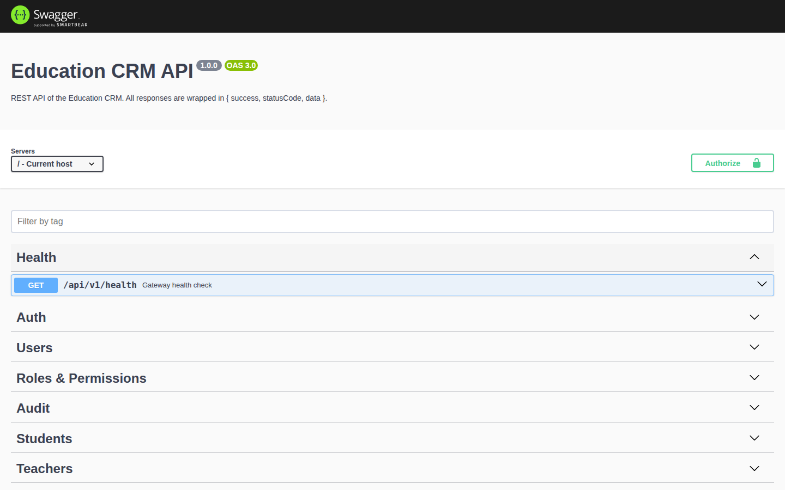

# Education CRM

O'quv markazlari uchun production darajasidagi CRM tizimi. O'quvchilar, ota-onalar, o'qituvchilar,
kurslar, guruhlar, haftalik dars jadvali, darslar, davomat, oylik invoyslar, to'lovlar va qarzdorlik,
dinamik rollar va ruxsatlarga ega xodimlar, bildirishnomalar (ilova ichida, real vaqtda va Telegram orqali),
boshqaruv paneli hamda hisobotlarni boshqaradi. Interfeys o'zbek, ingliz va rus tillarida ishlaydi.

## Imkoniyatlar

- **O'quvchilar**: pasport ma'lumotlari, ota-onalar va favqulodda aloqa, rasm yuklash, guruhlar, davomat,
  to'lovlar, qarzdorlik va o'qish tarixi bilan to'liq profil; ixtiyoriy o'quvchi kirish hisobi.
- **O'qituvchilar**: profil, mutaxassislik, maosh ma'lumotlari, biriktirilgan guruhlar, haftalik jadval,
  statistika va bugungi / belgilanmagan darslar ko'rsatilgan shaxsiy panel.
- **Kurslar va kategoriyalar** oylik narx bilan. **Guruhlar**: o'qituvchi, xona, sig'im, biriktirish
  (chegirma, chiqish, qayta biriktirish), statistika va davomat jurnali.
- **Dars jadvali**: guruh uchun haftalik slotlar, o'qituvchi va xona **to'qnashuvlarini aniqlash**,
  haftalik kalendar ko'rinishi.
- **Darslar va davomat**: slotlardan generatsiya yoki qo'lda yaratish; PRESENT / ABSENT / LATE / EXCUSED
  bilan ommaviy belgilash; o'quvchi, guruh, o'qituvchi va oy bo'yicha statistika.
- **Hisob-kitob**: har bir biriktirish uchun oylik invoyslar (talab bo'yicha va oylik job orqali),
  to'lovlarni aniq invoysga yoki FIFO tartibida eng eski to'lanmagan invoyslarga taqsimlash, qaytarish va
  bekor qilish, o'quvchi balansi va qarzdorligi, qarzdorlar ro'yxati, muddati o'tganlarni aniqlash.
- **Bildirishnomalar**: domen hodisalari foydalanuvchi bildirishnomalarini yaratadi; ular ilova ichida,
  Socket.IO orqali real vaqtda va **Telegram bot** orqali (telefon raqam bilan hisobni bog'lash,
  `/status`, eslatmalar) yetkaziladi.
- **Boshqaruv paneli va hisobotlar**: hisoblagichlar, bugungi ko'rsatkichlar, daromad va davomat
  dinamikasi, chartlar, so'nggi harakatlar; daromad, davomat va o'quvchilar hisobotlari.
- **Xavfsizlik**: rotatsiyali JWT access/refresh tokenlar, bcrypt, Helmet, CORS, rate limiting,
  validatsiya, dinamik ruxsat katalogiga ega RBAC, rol bo'yicha ma'lumotlarni cheklash, audit jurnali.
- **Swagger** (`/api/docs`), **Docker Compose** bilan bitta buyruqda ishga tushirish, TypeORM
  migratsiyalari, idempotent seedlar.

## Skrinshotlar

Barcha sahifalarning rasmlari [docs/FRONTEND.md](docs/FRONTEND.md#skrinshotlar) da. Asosiylari:

| Kirish sahifasi | Boshqaruv paneli |
| --- | --- |
|  |  |

| O'quvchilar ro'yxati | O'quvchi profili |
| --- | --- |
|  |  |

| Guruh davomat jurnali | Dars jadvali (haftalik kalendar) |
| --- | --- |
|  |  |

| Davomat belgilash | To'lov qabul qilish |
| --- | --- |
|  |  |

| Qarzdorlar | Hisobotlar |
| --- | --- |
|  |  |

| O'qituvchi paneli | O'quvchi portali |
| --- | --- |
|  |  |

| Swagger | Mobil ko'rinish |
| --- | --- |
|  |  |

## Texnologiyalar

| Qatlam | Texnologiya |
| --- | --- |
| Frontend | Vue 3.4 (Composition API), TypeScript, Vite 5, Vue Router 4, Pinia 2, Axios, vue-i18n 9, SCSS, Chart.js 4 / vue-chartjs, socket.io-client |
| Backend | NestJS 10, TypeScript, NestJS Microservices (Redis transport), TypeORM 0.3, PostgreSQL 16, Redis 7, Passport JWT, Swagger (OpenAPI 3), class-validator, Joi, @nestjs/schedule, Socket.IO |
| Infratuzilma | Docker, Docker Compose, nginx |
| Test | Jest, ts-jest, supertest |

## Arxitektura

```text
Brauzer ── nginx (frontend) ──┬── /api/v1/*   ──► API Gateway (HTTP, Swagger, JWT, RBAC, WebSocket)
                              └── /socket.io  ──┘            │  Redis orqali NestJS Microservices
                                                              ▼
   auth · user · student · teacher · course · group · schedule · attendance · payment ·
   notification (+ Telegram) · report · file servislari  ──►  PostgreSQL (umumiy entity kutubxonasi)
```

Backend bitta NestJS monorepo (`backend/apps/*`, `backend/libs/*`). Bitta Docker image quriladi, har bir
konteyner boshqa entry point bilan ishga tushadi. Batafsil: [docs/ARCHITECTURE.md](docs/ARCHITECTURE.md)
va [docs/MICROSERVICES.md](docs/MICROSERVICES.md).

## Talablar

- Docker 24+ va Docker Compose v2 (konteynerlar bilan ishga tushirish uchun), yoki
- Node.js 20+, npm 10+, PostgreSQL 16 va Redis 7 (lokal ishlab chiqish uchun).

## Docker bilan tez ishga tushirish

```bash
cp .env.example .env
docker compose build
docker compose up -d
docker compose ps
```

| Servis | URL |
| --- | --- |
| Frontend | http://localhost:8080 |
| API | http://localhost:3000/api/v1 |
| Swagger | http://localhost:3000/api/docs |
| Health | http://localhost:3000/api/v1/health |

`migrator` konteyneri migratsiyalarni bajaradi, demo ma'lumotlarni seed qiladi va tugaydi; backend
servislar uni kutadi. Faqat rollar va ruxsatlarni seed qilish uchun `.env` da `SEED_DEMO_DATA=false`
qo'ying.

## Demo hisoblar

Barcha demo hisoblar uchun parol: `Password123!`

| Rol | Email |
| --- | --- |
| SUPER_ADMIN | superadmin@crm.local |
| ADMIN | admin@crm.local |
| MANAGER | manager@crm.local |
| CASHIER | cashier@crm.local |
| TEACHER | teacher@crm.local (shuningdek teacher2@, teacher3@) |
| STUDENT | student@crm.local |

## Lokal ishlab chiqish

```bash
cp .env.example .env
docker compose -f docker-compose.dev.yml up -d
```

`.env` da `POSTGRES_HOST=localhost`, `POSTGRES_PORT=5433`, `REDIS_HOST=localhost`, `REDIS_PORT=6380`
qiymatlarini qo'ying (dev compose fayli infratuzilmani lokal o'rnatilgan PostgreSQL yoki Redis bilan
to'qnashmasligi uchun shu portlarda ochadi).

### Backend

```bash
cd backend
npm install
npm run migrate            # migratsiyalarni bajarish
npm run seed               # rollar, ruxsatlar va demo ma'lumotlar (idempotent)
npm run start:all          # gateway va 12 ta servisni ts-node bilan ishga tushirish
```

Alohida servislar: `npm run start:gateway`, `npm run start:auth`, `npm run start:students`, …
(`backend/package.json` ga qarang). Lokal servislarning health endpointlari 3100–3112 portlarda.

### Frontend

```bash
cd frontend
npm install
npm run dev                # http://localhost:5173, /api va /socket.io :3000 ga proxylanadi
```

### Migratsiyalar

```bash
cd backend
npm run migration:generate -- libs/database/src/migrations/<Nomi>
npm run migration:run
npm run migration:revert
```

Migratsiyalar `backend/libs/database/src/migrations` da. `synchronize` hamma joyda o'chirilgan.

## Testlar

```bash
cd backend
npm test                   # unit testlar (domen qoidalari, auth, guardlar, filtrlar)
npm run test:e2e           # gateway integratsion testlari (HTTP, RBAC, konvertlar)
cd ../frontend
npm run typecheck && npm run build
```

## Muhit o'zgaruvchilari

Barcha o'zgaruvchilar izohlari bilan [docs/ENVIRONMENT.md](docs/ENVIRONMENT.md) va `.env.example` da.
Secretlar repozitoriyga commit qilinmaydi; `.env` git tomonidan e'tiborga olinmaydi.

## Telegram bot

BotFather orqali bot yarating, tokenni `TELEGRAM_BOT_TOKEN` ga yozing va `TELEGRAM_BOT_ENABLED=true`
qiling. Foydalanuvchilar, o'quvchilar va ota-onalar botga telefon raqamini yuborib (`/start`) hisobini
bog'laydi, so'ng to'lov tasdiqlari, invoyslar, dars qoldirish xabarlari va qarz eslatmalarini oladi
hamda `/status` orqali holatini ko'radi.

## Production build

```bash
cd backend && npm run build        # dist/apps/<servis>/src/main.js
cd ../frontend && npm run build    # dist/ nginx tomonidan xizmat ko'rsatiladi
```

Docker imagelar aynan shu buildlarni bajaradi; qarang: [docs/DOCKER.md](docs/DOCKER.md) va
[docs/DEPLOYMENT.md](docs/DEPLOYMENT.md).

## Muammolarni bartaraf etish

| Belgi | Yechim |
| --- | --- |
| `Service handling … is unavailable` (503) | Tegishli mikroservis ishlamayapti yoki Redis ga ulana olmayapti. `docker compose ps` va servis loglarini tekshiring. |
| Gateway Joi validatsiya xatosi bilan to'xtaydi | Majburiy o'zgaruvchi yo'q (`JWT_SECRET`, `JWT_REFRESH_SECRET`, `POSTGRES_*`). |
| `migrator` 1 kod bilan tugaydi | PostgreSQL tayyor emas yoki ma'lumotlar noto'g'ri; `docker compose logs migrator`. |
| Port band | `.env` da `FRONTEND_PORT`, `GATEWAY_PORT` yoki dev compose portlarini o'zgartiring. |
| Brauzerda login 401 qaytaradi | Seed bajarilmagan; `docker compose run --rm migrator` yoki `npm run seed`. |
| Telegram bot javob bermaydi | Token yo'q yoki `TELEGRAM_BOT_ENABLED` `true` emas; bitta tokenni faqat bitta jarayon poll qilishi mumkin. |

## Hujjatlar

[docs](docs) papkasida: arxitektura, loyiha strukturasi, ma'lumotlar bazasi, API, autentifikatsiya,
avtorizatsiya, mikroservislar, frontend, backend, ishlab chiqish, Docker, deploy, muhit o'zgaruvchilari
va hissa qo'shish qo'llanmalari.
